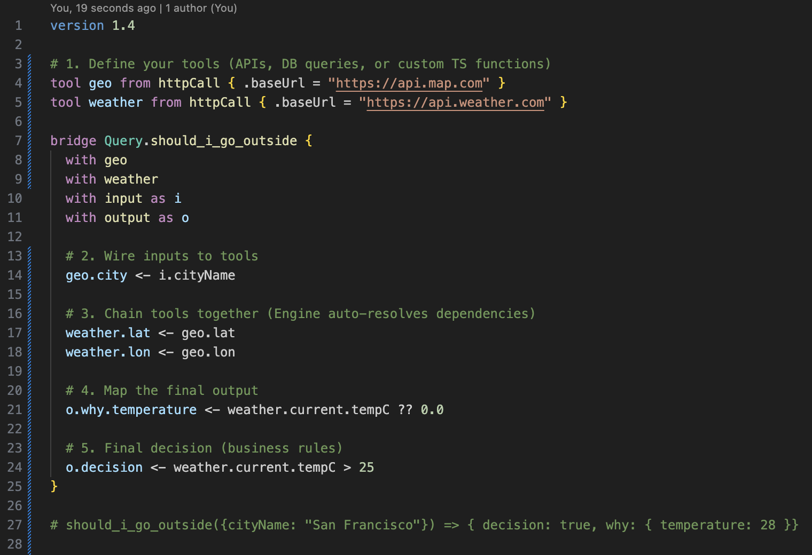
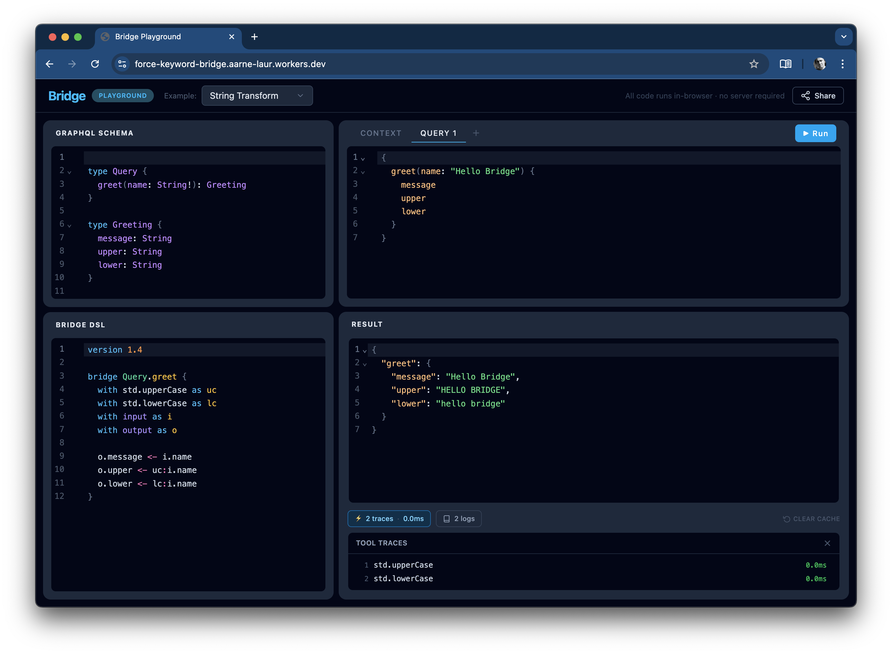

[](https://codecov.io/gh/stackables/bridge)
[](https://www.npmjs.com/package/@stackables/bridge)
[](https://marketplace.visualstudio.com/items?itemName=stackables.bridge-syntax-highlight)

# The Bridge

**A declarative dataflow language and execution engine.**

The Bridge replaces imperative orchestration code with static `.bridge` files. Instead of writing complex `async/await` logic, manual `Promise.all` wrappers, and custom data mappers, you simply define **what** data you need and **where** it comes from.

The Bridge engine parses your wiring diagram, builds a dependency graph, and executes it - automatically handling parallelization, fallbacks, and data reshaping.

- [See our roadmap](https://github.com/stackables/bridge/milestones)
- [Feedback in the discussions](https://github.com/stackables/bridge/discussions/1)
- [Performance report - interpreter](./packages/bridge-core/performance.md)
- [Performance report - compiler](./packages/bridge-compiler/performance.md)

### How it looks

You write the topology; the engine handles the execution.



### Why a language instead of code?

- **Zero Orchestration Boilerplate:** The engine inherently knows which tools can run concurrently. No manual `Promise.all`, DataLoader plumbing, or batching glue required.
- **Separation of Concerns:** Keep your core business logic inside isolated TypeScript tools, completely separate from your routing, mapping, and orchestration logic.
- **Safe for LLM Automation:** Because The Bridge is a strictly declarative, constrained dataflow language, it is much safer for AI generation than general-purpose code. You can confidently let an LLM wire up your API mappings without the risk of it hallucinating infinite loops, memory leaks, or rogue system calls.
- **Hot-Reloadable Logic:** Since `.bridge` files are just text parsed into an execution graph, you don't need to recompile, rebuild, or redeploy your entire Node application to change a data mapping or swap an API provider. You can update and hot-reload your rules on the fly.
- **Portable Execution:** The engine is hyper-lightweight and framework-agnostic. Run it in a Node backend, an Edge Worker (Cloudflare/Vercel), or directly in the browser.

### Primary Use Cases

Because The Bridge strictly controls how data flows from inputs to tools to outputs, it is the perfect engine for architectures that require strict boundaries and clean mappings.

1. **[The "No-Code" BFF (Backend-for-Frontend)](https://bridge.sdk42.com/guides/bff/)**
   Spin up a GraphQL BFF without maintaining a secondary codebase of resolvers, types, and DTOs. Frontend teams can aggregate and shape backend data just by writing `.bridge` files.
1. **[The Egress Gateway](https://bridge.sdk42.com/guides/egress/)**
   Funnel external third-party API calls through a single point. Swap providers (e.g., SendGrid ↔ AWS SES) by changing a `.bridge` file without ever touching the calling service's code.
1. **[The Rule Engine / Policy Evaluator](https://bridge.sdk42.com/guides/rule-engine/)**
   Encapsulate complex conditional business logic and data enrichment into a single, highly readable file that returns a boolean. Perfect for authorization checks or fraud detection flows.

### Feature Highlights

- **Human-Readable Runtime Errors:** `formatBridgeError(err)` renders Rust-style source snippets with filename, line/column, and carets pointing at the failing wire.
- **Native DataLoader Pattern:** Mark a custom tool with `bridge.batch` and Bridge batches loop-scoped calls automatically in both the interpreter and the compiler.

## The Playground

Try The Bridge instantly in your browser at **[https://bridge.sdk42.com/playground/](https://bridge.sdk42.com/playground/)**

The playground is fully client-side. **Your API keys, schemas, and data are NEVER sent to our servers.** All parsing, routing, and HTTP execution happens directly inside your browser.

Want to run it offline or within your own VPN? You can spin up the playground locally by building the `./packages/playground` workspace directly from this repository.



## Core Concepts: Wiring, not Programming

The Bridge is a **Data Topology Language**. You don't write scripts; you wire circuits.

- **Pull, Don't Push:** The engine is strictly lazy. If a client doesn't ask for a specific output field, the wires connected to it are "dead"—no code runs, and no external APIs are called.
- **Cost-Optimized Fallbacks:** The engine knows the difference between a cheap memory read and an expensive network call, automatically evaluating them in the optimal order.
- **LLM Friendly:** The language is visually distinct and heavily structural, making it incredibly easy for LLMs to generate correct API mappings from standard JSON schemas or OpenAPI specs.

**Don't think in scripts. Think in schematics.**

## Syntax Cheat Sheet

The `.bridge` language is designed to be scannable.

- `.` prefix means a property.
- `=` means static constant assignment.
- `<-` means dynamic data flow.

| Concept           | Syntax Example                 | Description                                                                             |
| ----------------- | ------------------------------ | --------------------------------------------------------------------------------------- |
| **Constants**     | `.method = "POST"`             | Sets a static configuration value.                                                      |
| **Wires**         | `.body <- i.userData`          | Pulls data from a source at runtime.                                                    |
| **Side Effects**  | `force api catch null`         | Eagerly schedules a handle. Critical by default; `catch null` makes it fire-and-forget. |
| **Pipes**         | `o.name <- uc:i.name`          | Chains data through a tool right-to-left.                                               |
| **Null Coalesce** | `o.name <- i.name \|\| "N/A"`  | Alternative used if the current source resolves to `null`.                              |
| **Error Guard**   | `o.price <- api.price catch 0` | Alternative used if the current source **throws** an exception.                         |
| **Ternary**       | `o.val <- i.isPro ? a : b`     | Evaluates condition; strictly pulls only the chosen branch.                             |
| **Node Alias**    | `alias uc:i.name as name`      | Evaluates an expression once and caches it as a local graph node.                       |
| **Arrays**        | `o <- items[] as it { }`       | Iterates over an array, creating a local shadow scope for each element.                 |

**[Read the Full Language Guide](https://bridge.sdk42.com/reference/10-core-concepts/)**

## Tools

To The Bridge engine, everything external is just a "Tool". A Tool is simply a JavaScript function that takes a JSON object as input, and returns a JSON object (or Promise) as output.

The Bridge ships with a standard library (`std`) that includes tools for HTTP requests, array manipulation, and basic string formatting.

You can inject your own custom tools into the engine in three lines of code:

```typescript
const myTools = {
  // A simple synchronous tool
  calculateTax: (input) => ({ total: input.price * 1.2 }),

  // An asynchronous database call
  fetchUser: async (input) => await db.users.findById(input.id),
};

// Standalone mode:
const { data } = await executeBridge({
  instructions,
  operation,
  input,
  tools: myTools,
});

// Gateway mode:
const schema = bridgeTransform(createSchema({ typeDefs }), instructions, {
  tools: myTools,
});
```

**[Read the Tools & Extensions Guide](https://bridge.sdk42.com/advanced/custom-tools/)**
